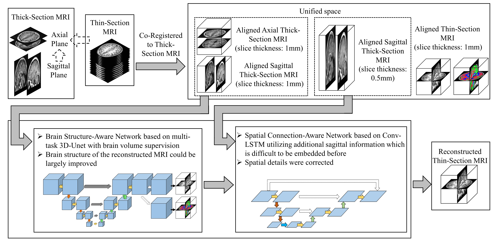

# DeepVolume

## Introduction

DeepVolume is a deep learning based method to reconstruct thin-section brain MR images by including
much domain knowledge such as brain structure and additional sagittal spatial connection constrains. In our study,
we demonstrate DeepVolume can not only provide state-of-the-art thin-section MRI reconstruction results but also benefit the
brain volume estimation and voxel-based morphometry based on thick-section MRI.

The pipeline of DeepVolume is summarized as:

<br/> <div align=center></div>

## Test
- Download the example data in [Data](https://drive.google.com/file/d/1D9kZRk9p5f7KD2ZHgItzjRg5bP1wiOrp/view?usp=sharing)
- Unzip the data and put them in folder dataForExamples
- Download the pretrain model in [PretrainModel](https://drive.google.com/file/d/1Eyhnj9kyXllOayW3YC64MuQo58zT9hf7/view?usp=sharing)
- Unzip the model and put them in folder models
- cd test
```
python DeepVolume_test.py -s 1
```
- cd test
```
python DeepVolume_test.py -s 2
```
- Find the results as output/test1/pred.nii.gz

## Train
As I cannot share all the data for public use, the training cannot be reproduced totally. However I provide all the code for training, it might be helpful for related applications.

- Download the example data in [Data](https://drive.google.com/file/d/1D9kZRk9p5f7KD2ZHgItzjRg5bP1wiOrp/view?usp=sharing)
- Unzip the data and put them in folder dataForExamples
- cd preprocessing
```
matlab SamplingforBrainStructureAwareNetwork.m
```
- cd train
```
python BrainStructureAwareNetwork_train.py -val -train
```
- cd preprocessing
```
matlab SamplingForSpatialConnectionAwareNetwork.m
```
- cd train
```
python SpatialConnectionAwareNetwork_train.py
```

## Others
In the paper, we also do some preprocessing and analysis based on SPM. As it can be imagined, the code is trivial and highly taylored for this study and data. However, if you are interested in that or have any problems running the code in this repository, please contact me through email (zeju.li18@imperial.ac.uk).

If you are interested in the full access of the data in the paper, please contact Prof. Yu for details. (jhyu@fudan.edu.cn)

## Citation
If you find this useful in your research or publication, please consider to cite our work:
```
@article{li2019deepvolume,
  title={DeepVolume: Brain Structure and Spatial Connection-Aware Network for Brain MRI Super-Resolution},
  author={Li, Zeju and Yu, Jinhua and Wang, Yuanyuan and Zhou, Hanzhang and Yang, Haowei and Qiao, Zhongwei},
  journal={IEEE transactions on cybernetics},
  year={2019},
  publisher={IEEE}
}
```
